# Exercise for laboratory work 2 #
## Preparation ##

<table>
<tr><th>Step</th><th></th></tr>
<tr><td>Open <em>lab2.sln</em> file</td><td></td></tr>
<tr><td>Uncheck <em>"Enable browser link"</em></td><td>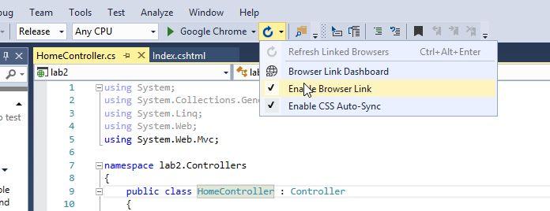</td></tr>
<tr><td>Right click on solution and restore nuget packages</td><td>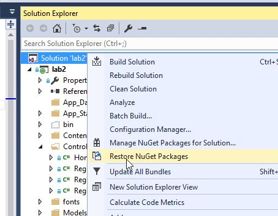</td></tr>
<tr><td>Click <em>"Start in Firefox"</em></td><td>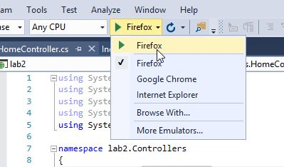</td></tr>
</table>

## Recording selenium script ##
<table>
<tr><th>Step</th><th></th></tr>
<tr><td>Navigate to the website</td><td>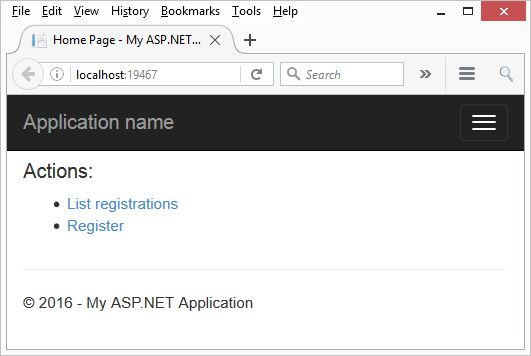</td></tr>
<tr><td>In Firefox click <em>"Options->Selenium IDE"</em></td><td>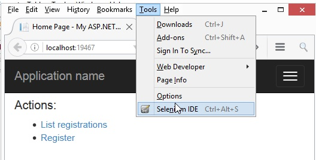</td></tr>
<tr><td>
Click recording button
</td><td>
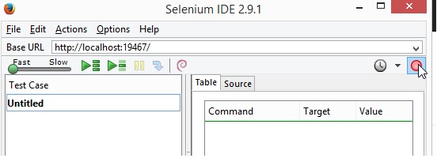
</td></tr>
<tr><td>
Perform the following steps:
 <ul><li>Click a link List registrations</li>
 <li>Click clear</li>
 </ul>
</td><td>
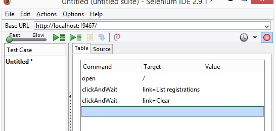
</td></tr>
<tr><td>
Right click on page, select <em>asssertTitle</em>
</td><td>
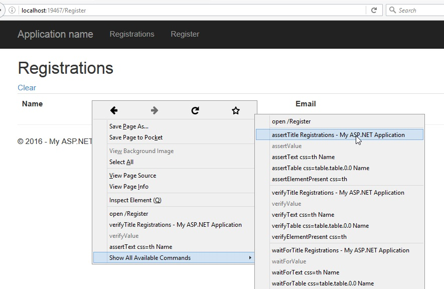
</td></tr>
<tr><td>
Record second scenario:
<ul>
<li>Click a link on top Registrations</li>
<li>Click Clear</li>
<li>Click on Register link on top</li>
<li>Enter valid name and email</li>
<li>Wait for element with id statusText present</li>
<li>Assert that Status text contains your entered name</li>
</ul>
</td><td>
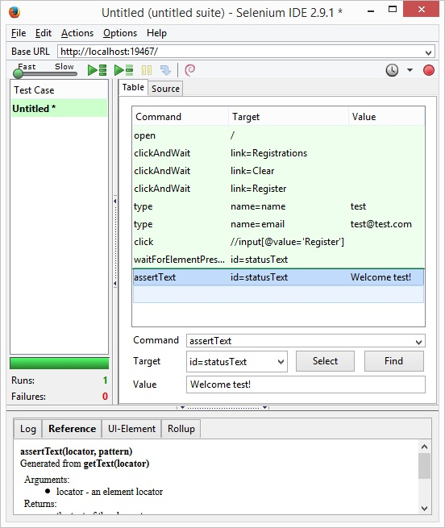
</td></tr>

</table>

## Recording Loadrunner script ##
### Setting up scripts ###
<table>
<tr><th>Steps</th><th></th>
</tr>
<tr><td>
Open Virtual User Generator
</td><td>
</td></tr>

<tr><td>
Click <em>"File->New script and solution"</em>
</td><td>
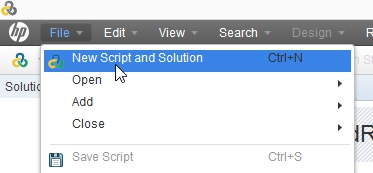
</td></tr>

<tr><td>
Enter details
</td><td>
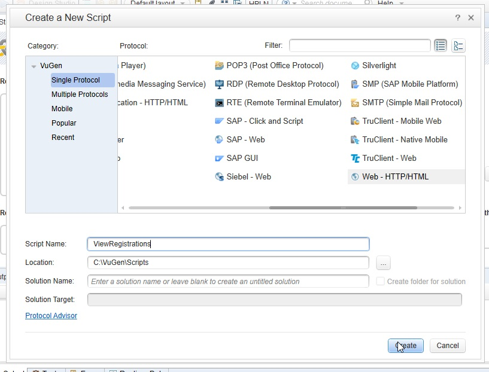
</td></tr>
<tr><td>
Click record button
</td><td>
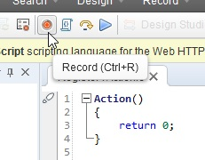
</td></tr>
<tr><td>
Enter details
</td><td>

</td></tr>
<tr><td>
Enter details and click <em>"Start recording"</em>
</td><td>
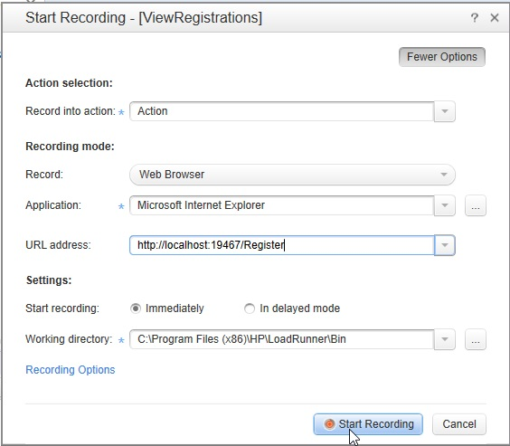
</td></tr>
<tr><td>
Wait for the page to load and click <em>"Stop"</em> button
</td><td>
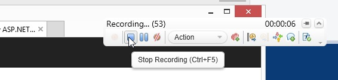
</td></tr>
<tr><td>
Verify your recorded script by hitting <em>"Replay"</em> button
</td><td>
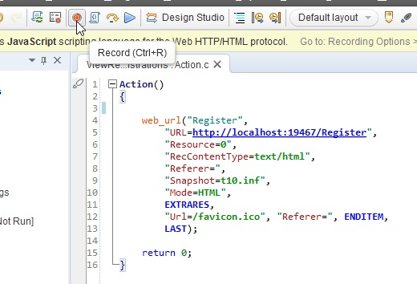
</td></tr>

<tr><td>
Create a new script for registration. Click Record button
</td><td>
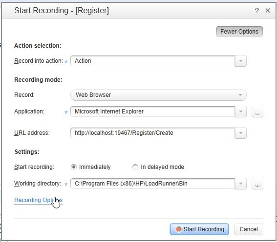
</td></tr>
<tr><td>
Click Recording Options. Click HTML advanced and select options to record only URLs.
</td><td>
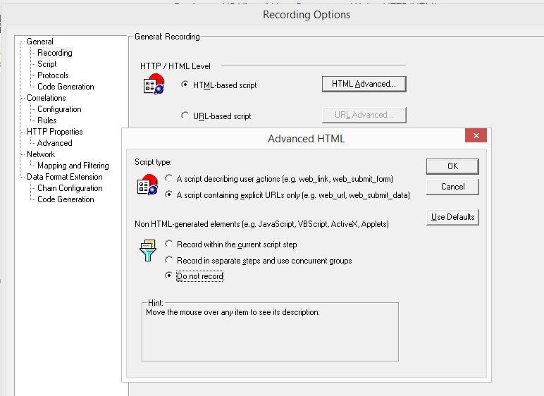
</td></tr>

<tr><td>
In form enter name and email. Submit and click stop recording button.
</td><td>
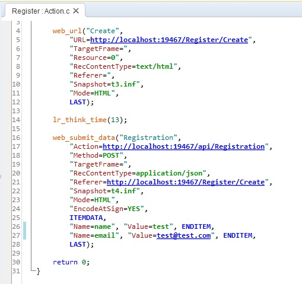
</td></tr>

<tr><td>
Try replaying your script. It should fail. If you cleared cache by navigating to Registrations/Clear then it would start passing.
</td><td>
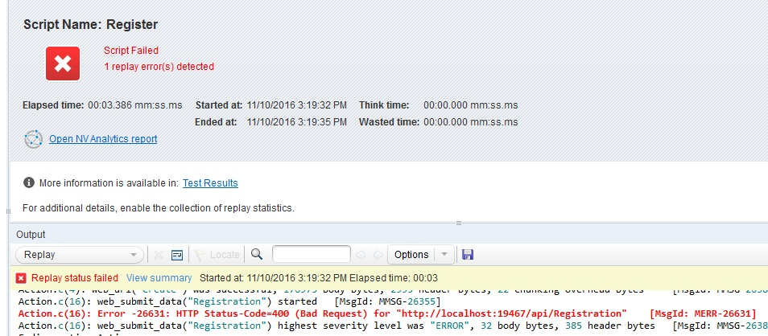
</td></tr>
<tr><td>
Parametrise script by using a text file with the following content (you could use test data generator such as http://www.generatedata.com/):
<pre>
Email,Name,Surname
dolor.sit.amet@eratvelpede.net,Jocelyn,Colon
semper.erat.in@diamSed.com,Juliet,Slater
nibh.dolor@tinciduntorci.net,Troy,Humphrey
auctor@vitae.edu,Jolene,Howell
libero.est.congue@aliquam.net,Vivian,Stevens
ligula.Donec.luctus@ullamcorperDuis.co.uk,Kylan,Best
varius.Nam.porttitor@nuncsitamet.net,Vivien,Key
</pre>
</td><td>
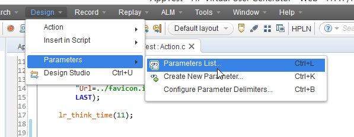 
 
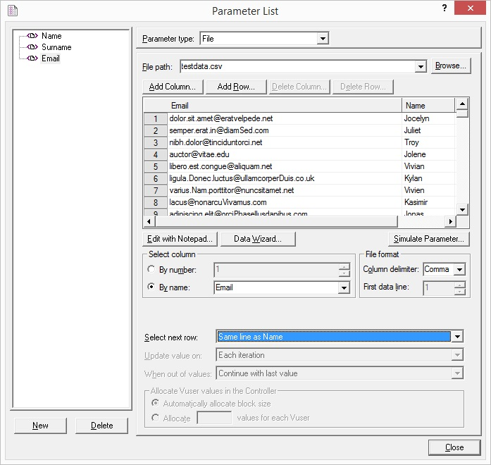
</td></tr>
<tr><td>
Update script to use your parameters.
</td><td>
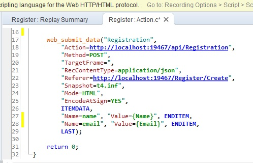
</td></tr>

<tr><td>
Parametrise script by using timestamp function.
</td><td>
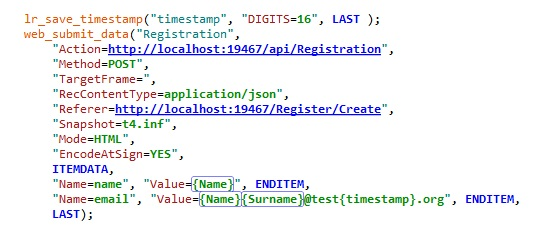
</td></tr>

<tr><td>
Add transaction to measure times to both your scripts (use different names for both scripts).
</td><td>
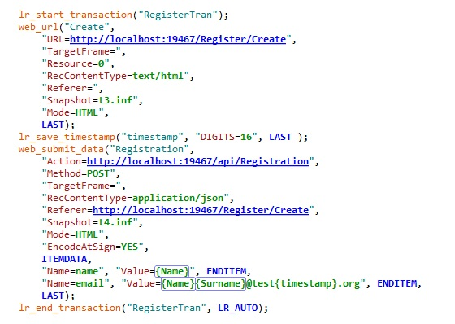
</td></tr>
</table>

### Setting up controller scenario ###
<table>
<tr><th>Steps</th><th></th>
</tr>
<tr><td>
Open Controller
</td><td>
</td></tr>

<tr><td>
Include your scripts into scenario.
</td><td>
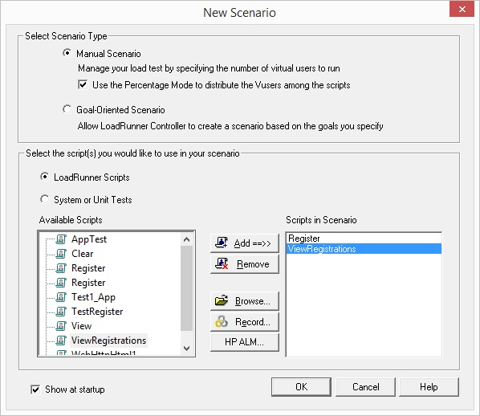
</td></tr>

<tr><td>
Convert scenario to percentage mode.
</td><td>
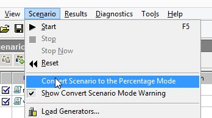
</td></tr>

<tr><td>
Update runtime options to:

<ul><li>Ignore think time</li>
<li>Disable logging</li></ul>
</td><td>
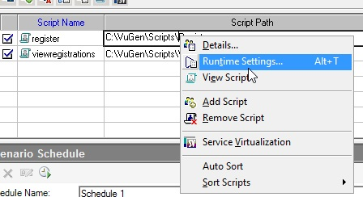
</td></tr>

<tr><td>
Setup schedule.
</td><td>
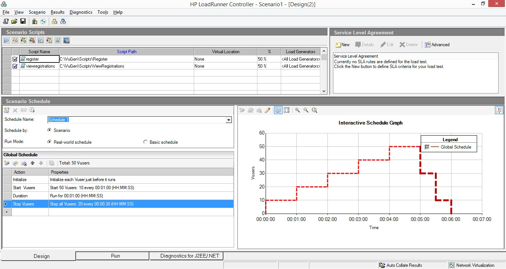
</td></tr>

<tr><td>
Click start.
</td><td>
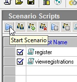
</td></tr>

<tr><td>
After scenario finishes, click <em>"Analyze results"</em>.
</td><td>
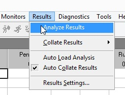
</td></tr>
</table>